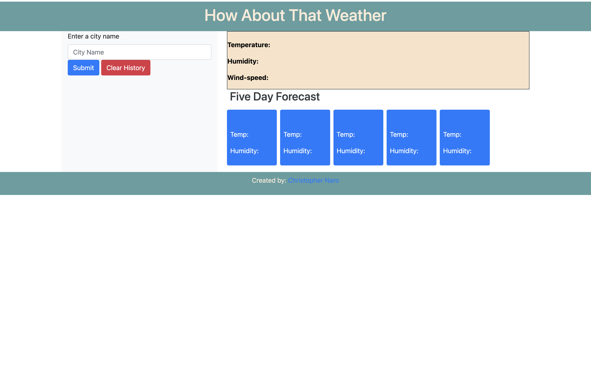
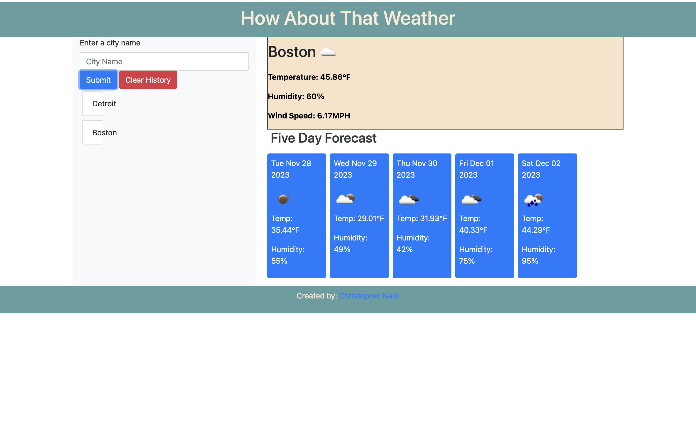

# how-about-that-weather-06
Weather Dashboard using APIs

## Table of Content

- Description
- Usage
- Features

## Description

"How About That Weather" App is a user-friendly application that fetches real-time weather data using the OpenWeatherMap API. It provides both the current weather conditions and a 5-day forecast for cities selected by the user. Additionally, the app maintains a list of recently searched cities for quick access to updated weather information.

## Usage

<Provide instructions and examples for use. Include screenshots as needed.>
To use the Weather App, follow these steps:

Open the webpage on your local machine.
Run the app locally or deploy it to a hosting service.
Upon launching the app:

Enter the desired city in the search bar.
View the current weather details and the 5-day forecast for the selected city.
Recent searches are saved for convenient access to updated weather information.

Fetches and displays real-time weather conditions for the selected city.
Shows temperature, humidity, wind speed, and other relevant data.

## Acknowledgments

Referenced following websites:

- https://openweathermap.org/
- https://stackoverflow.com
- https://www.w3schools.com
- https://forum.codewithmosh.com/
- Special thanks to Xpert, the AI Learning Assistant, for providing valuable assistance and guidance.

## License

---MIT License

Copyright (c) [2023] [Christopher Robert Naro]

Permission is hereby granted, free of charge, to any person obtaining a copy
of this software and associated documentation files (the "Software"), to deal
in the Software without restriction, including without limitation the rights
to use, copy, modify, merge, publish, distribute, sublicense, and/or sell
copies of the Software, and to permit persons to whom the Software is
furnished to do so, subject to the following conditions:

The above copyright notice and this permission notice shall be included in all
copies or substantial portions of the Software.

THE SOFTWARE IS PROVIDED "AS IS", WITHOUT WARRANTY OF ANY KIND, EXPRESS OR
IMPLIED, INCLUDING BUT NOT LIMITED TO THE WARRANTIES OF MERCHANTABILITY,
FITNESS FOR A PARTICULAR PURPOSE AND NONINFRINGEMENT. IN NO EVENT SHALL THE
AUTHORS OR COPYRIGHT HOLDERS BE LIABLE FOR ANY CLAIM, DAMAGES OR OTHER
LIABILITY, WHETHER IN AN ACTION OF CONTRACT, TORT OR OTHERWISE, ARISING FROM,
OUT OF OR IN CONNECTION WITH THE SOFTWARE OR THE USE OR OTHER DEALINGS IN THE
SOFTWARE.

🏆 The previous sections are the bare minimum, and your project will ultimately determine the content of this document. You might also want to consider adding the following sections.

## Features

- CSS design
- JavaScript

## WEATHER DASHBOARD